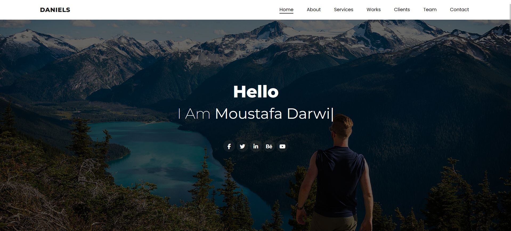
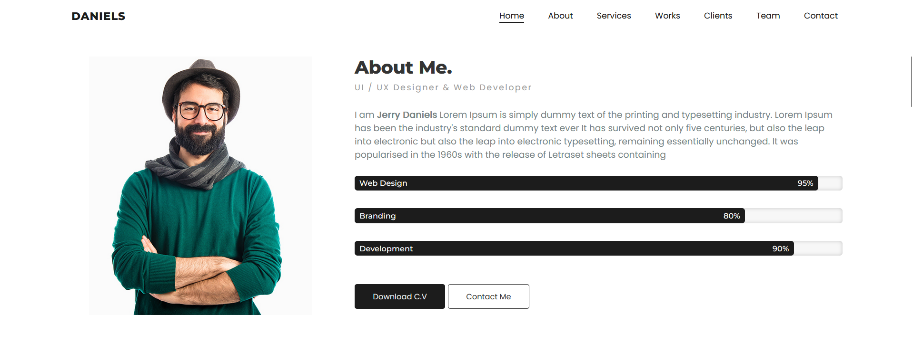
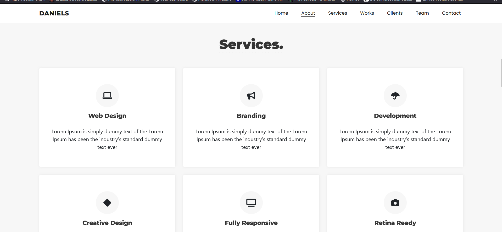
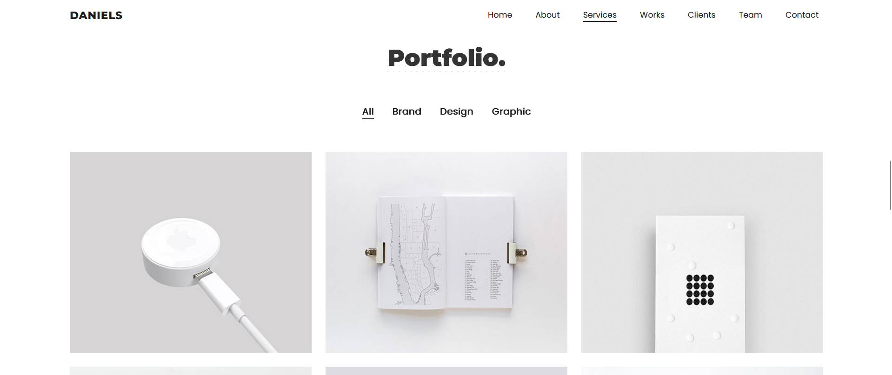
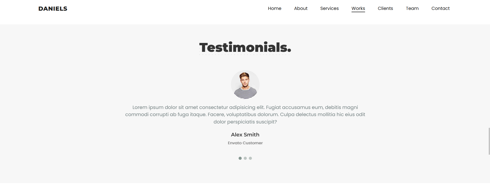
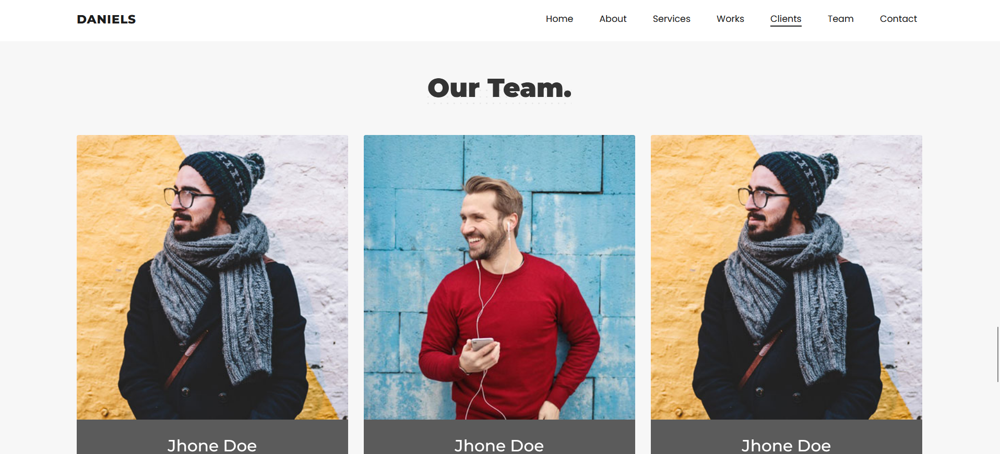
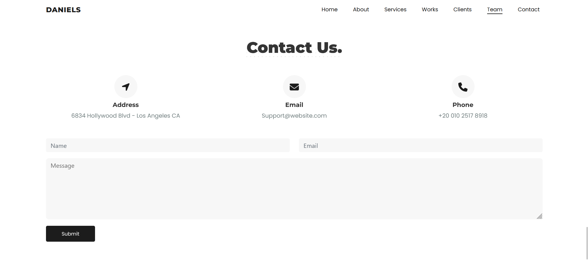

  

    
    
    

  

  <h3 align="center">PORTFOLIO</h3>
  <h2>A Portfolio Landing site done with HTML, CSS and Bootstrap 5</h2>

## Live Site: https://resilient-stardust-a6e43a.netlify.app/

## <a name="features">🔋 Add ons</a>

👉 **Fully Responsive**

👉 **SEO Friendly**

